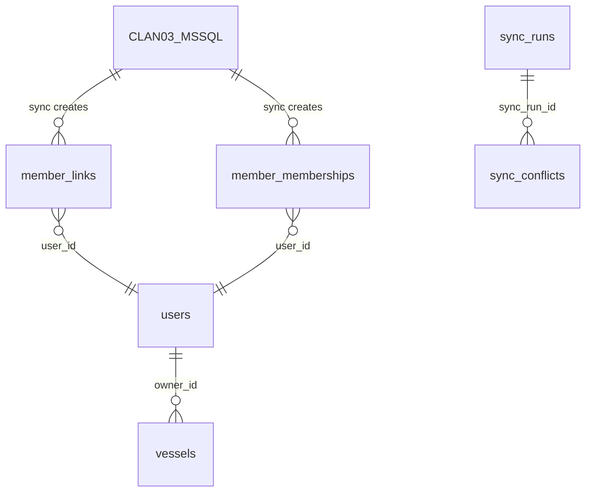

# Member Service — MSSQL → PostgreSQL Sync Modul (v3.1)

Zaseban backend modul za jednosmjernu sinkronizaciju članova i plovila iz legacy MSSQL baze (`CLAN03`) u PostgreSQL (`users` + `vessels`).

## Pregled konteksta

| Sustav | Baza | Uloga |
|---|---|---|
| Legacy desktop app | MS SQL Server (`CLAN03` tablica) | **Source of truth** — tu se unose i mijenjaju podaci o članovima |
| Crane Booking App | PostgreSQL (`users`, `vessels`) | **Read model** — prima podatke putem sync-a |

**Faza 1**: Samo MSSQL → PostgreSQL. Nema pisanja nazad u MSSQL.

---

## Proposed Changes

### Komponenta 1: Schema izmjene — Postojeće tablice

#### [MODIFY] [schema.ts](file:///c:/Users/Administrator/GITHUB/crane-booking-app/drizzle/schema.ts)

- `users.email` → nullable (članovi bez emaila su pasivni zapisi)
- `users.jmbg_hash` → novi stupac (SHA-256, nikad se ne prikazuje)
- `vessels.registration` → UNIQUE constraint

### Komponenta 2: Nove tablice

- `member_links` — UUID ↔ legacy MAT_BROJ mapiranje
- `member_memberships` — Članstvo u klubovima + `active_member` flag
- `sync_runs` — Audit trail sinkronizacija
- `sync_conflicts` — Konfliktni zapisi za ručno rješavanje

### Komponenta 3: MSSQL pristupni sloj

- `mssqlClient.ts` — Connection pool (tedious driver), retry, graceful shutdown
- `mssqlQueries.ts` — SQL upiti prema CLAN03

### Komponenta 4: Sync Engine — Full Sync svakih 60 min

**Deduplikacija (3 razine):**
- Razina 0: `member_links WHERE legacy_mat_broj = ?` (najbrža, cache)
- Razina 1: `users WHERE oib = ?` (rijetko jer je OIB većinom prazan u CLAN03)
- Razina 2: `users WHERE lower(first_name) = ? AND lower(last_name) = ?`

**Soft-delete**: Nikad ne brisati `users` ni `vessels`. Članovi koji nestanu iz CLAN03 dobivaju `member_memberships.active_member = false`.

### Komponenta 5: Scheduler — Node.js `setInterval` (Windows 11)

- **NEMA sistemskog cron-a** — koristi Node.js `setInterval` (isti pristup kao notifications.ts)
- Env varijabla: `MEMBER_SYNC_INTERVAL_MIN=60` (broj minuta)
- Mutex lock: ne pokreće novi sync dok prethodni traje
- Prvi sync 30s nakon starta servera

### Komponenta 6: tRPC Router

Admin-only procedure: getSyncHistory, getMemberLinks, getMemberships, getMembersByClub, triggerManualSync, getConflicts, resolveConflict

### Komponenta 7: npm ovisnosti

```diff
+ "mssql": "^11.0.0"
+ "@types/mssql": "^9.1.0"
- "mysql2": "^3.15.0"
```

### Komponenta 8: Konfiguracija (.env)

```env
MSSQL_HOST=localhost
MSSQL_PORT=1433
MSSQL_DATABASE=brod
MSSQL_USER=sa
MSSQL_PASSWORD=your-mssql-password
MSSQL_ENCRYPT=false
MSSQL_TRUST_SERVER_CERT=true
MEMBER_SYNC_ENABLED=true
MEMBER_SYNC_INTERVAL_MIN=60
```

---

## Struktura direktorija

```
server/
  memberSync/
    index.ts
    mssqlClient.ts
    mssqlQueries.ts
    syncEngine.ts
    scheduler.ts
    memberSync.router.ts
    utils.ts
    types.ts
```

---

## ER Dijagram


